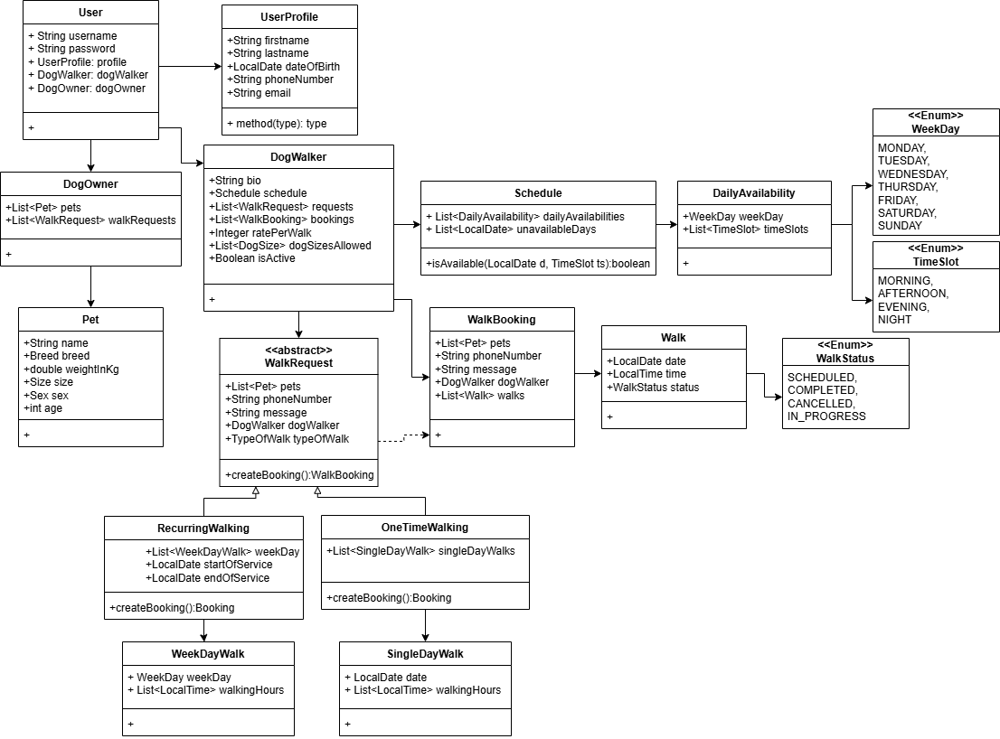

# The Walking Dogs App
Project for a Dog Walking and Care Services Application 

<!--
Features
-
- CRUD operations for routines
- CRUD operations for exercises and sets
- CRUD operations for custom exercises
- CRUD operations for workouts
- Statistics per workout and exercise
-->

Getting started
-
To get started with this project, you will need to have the following installed on your local machine:

* JDK 17+
* Maven 3+
* MySql

1) Database Configuration

    1. Make sure MySQL is installed and running on your system. By default, it will connect to the database on port 3306 with the user `root` and an empty password.
    
    2. If you have a different MySQL configuration, update the [application.yml](src/main/resources/application.yml) accordingly

2) To build and run the project, follow these steps:


   1. Clone the repository:
      ```
      git clone https://github.com/23737k/the-walking-dogs-app.git
      ```
      
   2. Navigate to the-walking-dogs-app directory:
      ```
      cd the-walking-dogs-app
      ```
   3. Install dependencies (assuming Maven is installed):
      ```
      mvn clean install
      ```
   4. Run the project
      ```
      mvn spring-boot:run
      ```
  
   5. Access the API documentation using Swagger UI:
      
      Open a web browser and go to http://localhost:8080/doc/swagger-ui.html

   > The application will be available at http://localhost:8080
   

Class Diagram
-


ERD Diagram

